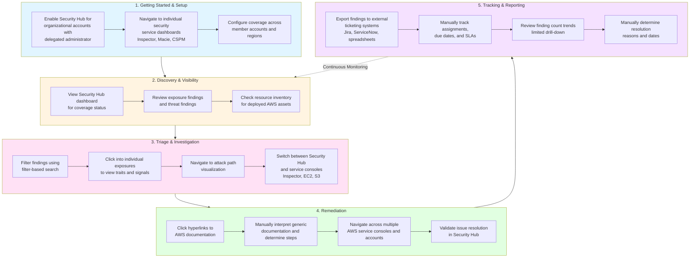

# AWS Security Hub Workflow - Block Diagram

## Workflow Stages

### 1. Getting Started & Setup
Initial configuration of Security Hub and related security services across the organization.

### 2. Discovery & Visibility
Ongoing monitoring and visibility into security posture, findings, and resource inventory.

### 3. Triage & Investigation
Deep dive into specific findings to understand context, relationships, and impact.

### 4. Remediation
Process of fixing identified security issues through manual interpretation and implementation.

### 5. Tracking & Reporting
Managing the lifecycle of findings, tracking progress, and reporting on security posture.

## Key Observations

- **Manual Steps**: Many steps require manual navigation between consoles and interpretation of documentation
- **Continuous Loop**: The workflow cycles back from tracking to discovery for ongoing monitoring
- **Multi-Console Navigation**: Users frequently switch between Security Hub and individual service consoles
- **External Integration**: Tracking often requires external tools like Jira or ServiceNow
